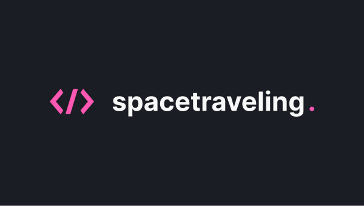

  

  <a href='#about'>📖 Sobre</a>&nbsp;&nbsp;&nbsp;|&nbsp;&nbsp;&nbsp;
  <a href="#design">🎨 Design</a>&nbsp;&nbsp;&nbsp;|&nbsp;&nbsp;&nbsp;
  <a href='#technologies'>🔩 Tecnologias</a>

 

  

# 📖 Sobre o Projeto

O **spacetraveling** é um blog sobre assuntos diversos, desde tecnologia até conselhos sobre carreira.

Este projeto faz parte de uma série de desafios a serem concluídos na trilha de ReactJS do curso Ignite da @Rocketseat.

A aplicação foi hospedada na [**Vercel**](https://vercel.com/), caso queira dar uma olhada, clique [**aqui**](https://spacetraveling-marcosjbm.vercel.app/).

# 🎨 Design

O design da aplicação está disponivel no [**Figma**](https://www.figma.com/), caso tenha interesse, clique [**aqui**](<https://www.figma.com/file/X4gUUgGdpJiDBBIyVtR6Rl/Desafios-M%C3%B3dulo-3-ReactJS-(Copy)?type=design&t=YZ7agwQnEU4AeaUg-6>).

# 🔩 Tecnologias

Estas foram as principais tecnologias utilizadas no desenvolvimento da aplicação.

- [React](https://react.dev/)
- [TypeScript](https://www.typescriptlang.org/)
- [NextJS](https://nextjs.org/)
- [Prismic](https://prismic.io/)
- [Sass](https://sass-lang.com/)
